# 🚀 Auto-Deploy Setup Guide

This guide will help you set up automatic deployment to Cloudflare Workers with GitHub Actions.

## 📋 Prerequisites

- GitHub account
- Cloudflare account
- Cloudflare API Token with these permissions:
  - `Workers Scripts:Edit`
  - `D1:Edit`
  - `Account Settings:Read`

## 🎯 Quick Start (5 minutes)

### Step 1: Get Cloudflare Credentials

1. **Get Account ID**:

   - Go to https://dash.cloudflare.com/
   - Copy your Account ID from the right sidebar

2. **Create API Token**:
   - Go to https://dash.cloudflare.com/profile/api-tokens
   - Click "Create Token"
   - Use "Edit Cloudflare Workers" template
   - Add D1 permissions
   - Copy the token (you won't see it again!)

### Step 2: Setup Cloudflare Resources

```bash
# Set environment variables
export CLOUDFLARE_API_TOKEN="your_token_here"
export CLOUDFLARE_ACCOUNT_ID="your_account_id_here"

# Optional: Customize resource names
export D1_DATABASE_NAME="my-app-db"
export KV_NAMESPACE_NAME="my-app-kv"
export R2_BUCKET_NAME="my-app-r2"

# Run setup script
pnpm setup:cloudflare
```

### Step 3: Configure GitHub Secrets

1. Go to your GitHub repository
2. Navigate to `Settings` → `Secrets and variables` → `Actions`
3. Click `New repository secret` and add:

| Name                    | Value           | How to get                     |
| ----------------------- | --------------- | ------------------------------ |
| `CLOUDFLARE_API_TOKEN`  | Your API token  | From Step 1                    |
| `CLOUDFLARE_ACCOUNT_ID` | Your account ID | From Step 1                    |
| `BETTER_AUTH_SECRET`    | Random secret   | Run: `openssl rand -base64 32` |

### Step 4: Enable Auto-Deploy

Choose your preferred workflow:

**Option A: Simple Deploy** (Recommended)

```bash
mv .github/workflows/deploy.yml.example .github/workflows/deploy.yml
```

**Option B: Full Auto-Deploy** (with resource checks)

```bash
mv .github/workflows/deploy-full.yml.example .github/workflows/deploy.yml
```

### Step 5: Deploy!

```bash
git add .
git commit -m "Enable auto-deploy"
git push origin main
```

Your app will automatically deploy! 🎉

## 🔄 Workflow Options Explained

### Simple Deploy (`deploy.yml.example`)

**Best for**: Production environments

**Pros**:

- ✅ Faster execution
- ✅ More reliable
- ✅ Cleaner logs

**Cons**:

- ❌ Requires manual resource setup first

**When to use**: After running `pnpm setup:cloudflare`

---

### Full Auto-Deploy (`deploy-full.yml.example`)

**Best for**: Experimentation, multiple environments

**Pros**:

- ✅ Automatically creates resources
- ✅ Good for testing
- ✅ Self-contained

**Cons**:

- ❌ Slower (checks resources every time)
- ❌ May fail on edge cases

**When to use**: Quick prototypes, throwaway projects

## 📊 What Happens on Each Push?

```mermaid
graph TD
    A[Push to main] --> B[GitHub Actions triggered]
    B --> C[Install dependencies]
    C --> D[Generate migrations]
    D --> E[Apply migrations to D1]
    E --> F[Build application]
    F --> G[Deploy to Cloudflare Workers]
    G --> H[Set secrets]
    H --> I[✅ Live!]
```



## 🛠️ Troubleshooting

### Issue: "Unauthorized" error

**Solution**:

```bash
# Check your API token has correct permissions
# Create a new token with these permissions:
# - Workers Scripts:Edit
# - D1:Edit
# - Account Settings:Read
```

### Issue: "Resource not found"

**Solution**:

```bash
# Run the setup script again
pnpm setup:cloudflare
```

### Issue: Migration fails

**Solution**:

```bash
# Apply migrations manually
pnpm db:migrate:prod

# Or check your D1 database exists
pnpm wrangler d1 list
```

### Issue: Build fails

**Solution**:

```bash
# Test build locally first
pnpm build

# Check for TypeScript errors
pnpm tsc --noEmit
```

## 🔐 Security Best Practices

1. **Never commit secrets** to your repository
2. **Use GitHub Secrets** for all sensitive data
3. **Rotate API tokens** regularly
4. **Use minimal permissions** for API tokens
5. **Enable branch protection** on `main` branch

## 🎓 Advanced: Multiple Environments

Want staging and production environments?

### Create separate workflows:

**`.github/workflows/deploy-staging.yml`**:

```yaml
on:
  push:
    branches:
      - develop
```

**`.github/workflows/deploy-production.yml`**:

```yaml
on:
  push:
    branches:
      - main
```

Use different GitHub Secrets for each environment:

- `STAGING_CLOUDFLARE_API_TOKEN`
- `PRODUCTION_CLOUDFLARE_API_TOKEN`

## 📚 Learn More

- [GitHub Actions Documentation](https://docs.github.com/en/actions)
- [Cloudflare Workers Documentation](https://developers.cloudflare.com/workers/)
- [Wrangler CLI Documentation](https://developers.cloudflare.com/workers/wrangler/)
- [Better Auth Documentation](https://better-auth.com/)

## 💡 Tips

- **Test locally first**: Always run `pnpm build` and `pnpm deploy` locally before pushing
- **Monitor deployments**: Check the Actions tab in GitHub for deployment status
- **Use manual triggers**: Add `workflow_dispatch` to trigger deployments manually
- **Set up notifications**: Configure GitHub to notify you of failed deployments

## 🆘 Need Help?

- Check the [GitHub Actions logs](https://github.com/your-repo/actions)
- Review [Cloudflare Workers logs](https://dash.cloudflare.com/)
- Open an issue in the repository
